# PES-VCS: Mini Version Control System

**Name:** Sunil S  
**USN:** PES1UG24CS634  
**Course:** Operating Systems Lab  

---

## 📌 Overview

This project implements a simplified version of Git called **PES-VCS**.  
It supports object storage, tree structures, indexing, commits, and history tracking.

The system uses:
- Content-addressable storage (SHA-256)
- Tree-based directory structure
- Commit linking using parent pointers

---

## ⚙️ Features Implemented

- `pes init` → Initialize repository  
- `pes add` → Stage files  
- `pes status` → Show file status  
- `pes commit -m "msg"` → Create commit  
- `pes log` → View commit history  

---

## 📸 Results and Screenshots

---

### 🔹 Phase 1: Object Storage

#### Test Output
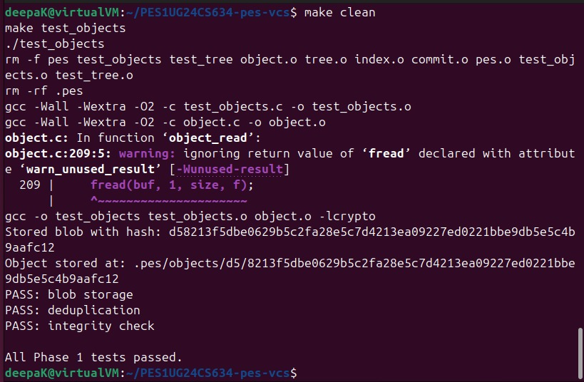

#### Object Directory
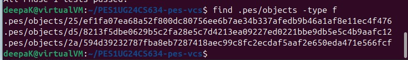

---

### 🔹 Phase 2: Tree Objects

#### Tree Test
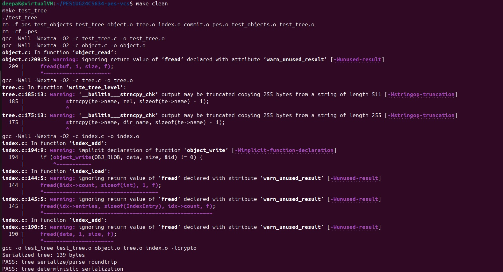

#### Raw Tree Object
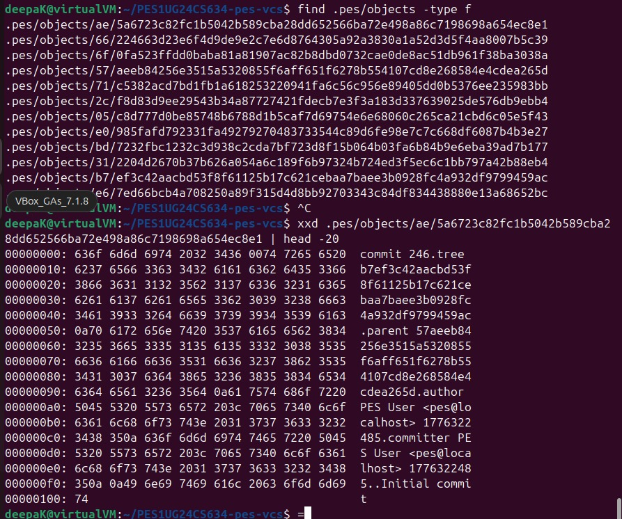

---

### 🔹 Phase 3: Index and Status

#### Init → Add → Status
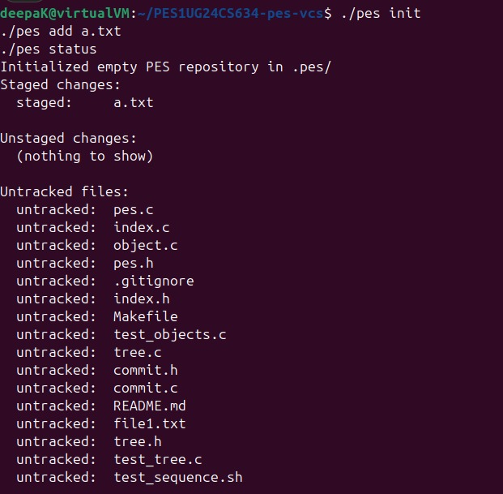

#### Index File
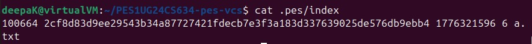

---

### 🔹 Phase 4: Commits and History

#### Initial Commit (2 screenshots)
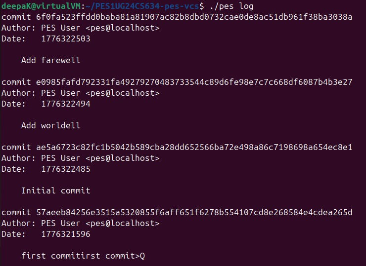
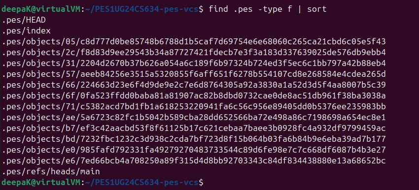

#### Object Growth
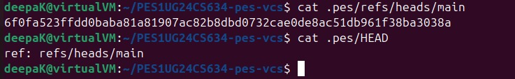

#### HEAD and Branch
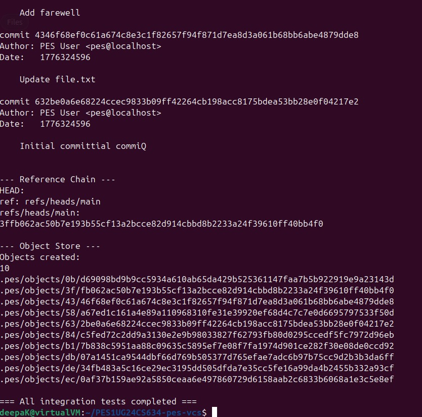

---

### 🔹 Final Integration Test

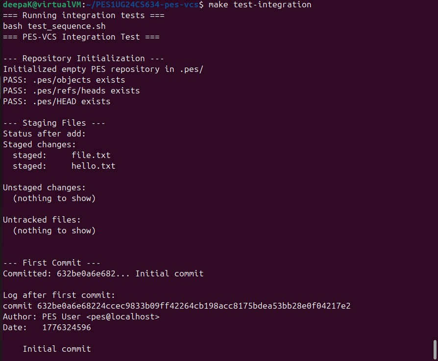

---

## 📘 Analysis Questions

---

### 🔹 Q5.1: Checkout Implementation

A branch is stored in `.pes/refs/heads/` as a file containing a commit hash.

To implement checkout:
- Read commit hash from branch file  
- Update `.pes/HEAD`  
- Load commit and extract tree  
- Update working directory files  

This operation is complex because it must prevent overwriting uncommitted changes and correctly rebuild directory structure.

---

### 🔹 Q5.2: Dirty Working Directory Detection

To detect changes:
- Compare file content hash with index  
- If mismatch → file is modified  

If a modified file differs in the target branch, checkout must be stopped to prevent data loss.

---

### 🔹 Q5.3: Detached HEAD

Detached HEAD means `.pes/HEAD` points directly to a commit.

- New commits can still be created  
- But no branch references them  
- These commits may become unreachable  

Recovery is possible by creating a new branch pointing to that commit.

---

### 🔹 Q6.1: Garbage Collection

Algorithm:
- Start from branch heads  
- Traverse commits → trees → blobs  
- Store reachable objects in a hash set  
- Delete objects not in the set  

For large repositories, this may involve visiting hundreds of thousands of objects.

---

### 🔹 Q6.2: GC Race Condition

Garbage collection during commit can cause issues:

- Commit creates new object  
- GC deletes it before reference is updated  

This results in repository corruption.

Git avoids this using:
- Locking mechanisms  
- Atomic updates  
- Safe object creation  

---

## ✅ Conclusion

This project demonstrates how Git internally manages:
- File storage using hashing  
- Directory representation using trees  
- Commit history using linked structures  

It provides a strong understanding of filesystem concepts and version control internals.
